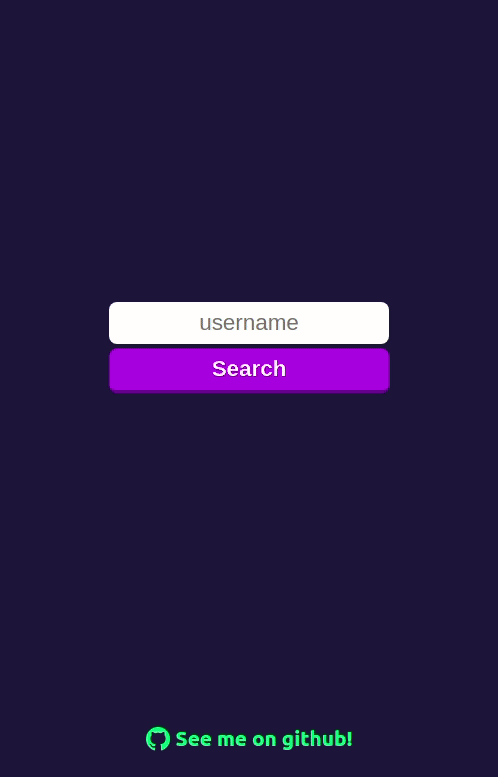

# ♟️ chess-explorer

This is a small project for studying and future reference on webpack configuration purposes, where a React project is setup from scratch, without tools like [create-react-app](https://create-react-app.dev). The goal is to create a SPA consuming [chess.com](chess.com) and public [countryflags.io](countryflags.io) APIs to search for chess players in the platform. The app currently looks like this:

  

What was done:

 - [Babel](babeljs.io) was setup to transpile ES6 and JSX code.

 - Configured [webpack](webpack.js.org) to import `jsx` files as well as `scss` and image files. Webpack will also link to Babel and bundle the whole application to be deployed.

 - Configured `webpack-dev-server` and `react-refresh-webpack-plugin` to improve the development process.

 

## Setting up Babel

## Configuring webpack

### Importing jsx files

### Importing scss files

### Importing images

## webpack dev server

### fast refresh
